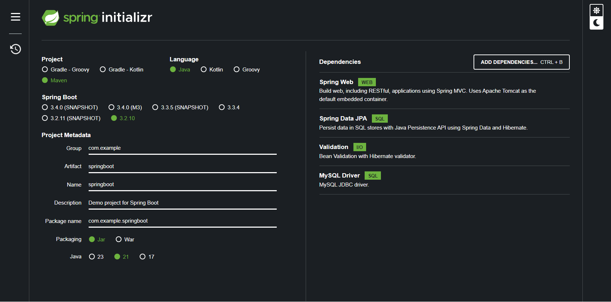

# Microservice de Produtos -  Spring Boot 3 

Este projeto é uma API desenvolvida em Spring Boot 3 para gerenciar produtos. O Microservice permite operações básicas como criação, leitura, atualização e exclusão de produtos.

## Pré-requisitos

Antes de começar, você precisará ter os seguintes softwares instalados:

-  **JDK**: 21.0.4 
-  **Maven**: 3.9.9

## Preparação do Ambiente

1. **Instalação do JDK**:
   - Baixe e instale o JDK 21.0.4 a partir do site oficial da [Oracle](https://www.oracle.com/java/technologies/javase-jdk21-downloads.html) ou [OpenJDK](https://jdk.java.net/21/).

2. **Instalação do Maven**:
   - Baixe e instale o Maven 3.9.9 a partir do site oficial do [Maven](https://maven.apache.org/download.cgi).
   - Após a instalação, adicione o Maven ao seu `PATH` do sistema.

3. **Clone o repositório**:
   ```bash
   git clone https://github.com/leo12wb/springboot-Products.git
   cd springboot-Products
4. **Compile o projeto**:
   ```bash
    mvn clean install
5. **Execute a aplicação**:
   ```bash
   mvn spring-boot:run

## Spring Boot dependencias



## Endpoints
A API expõe os seguintes endpoints:

GET /products - Lista todos os produtos.

GET /products/{uuid} - Obtém um produto pelo UUID.

POST /products - Cria um novo produto.

PUT /products/{uuid} - Atualiza um produto existente.

DELETE /products/{uuid} - Remove um produto pelo UUID.

## Contribuição
Se você quiser contribuir com este projeto, fique à vontade para enviar um Pull Request. Sinta-se à vontade para abrir issues para discutir novas funcionalidades ou melhorias.

## Licença
Este projeto está sob a licença MIT. Veja o arquivo LICENSE para mais detalhes.